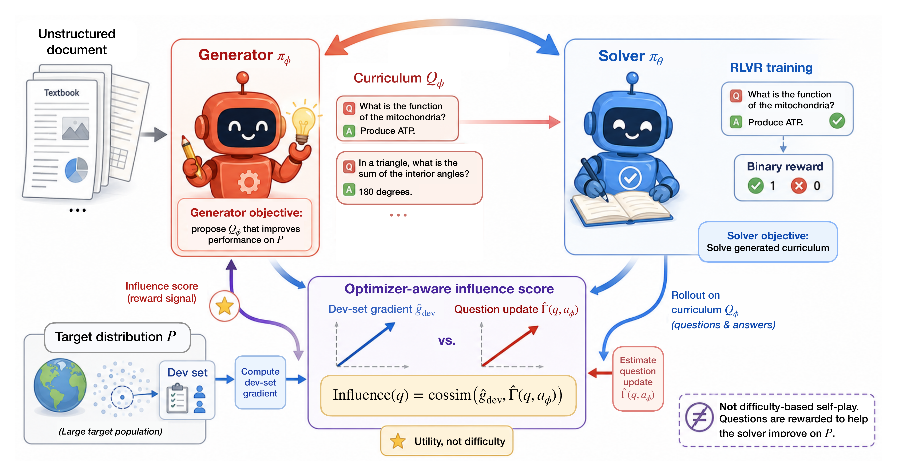
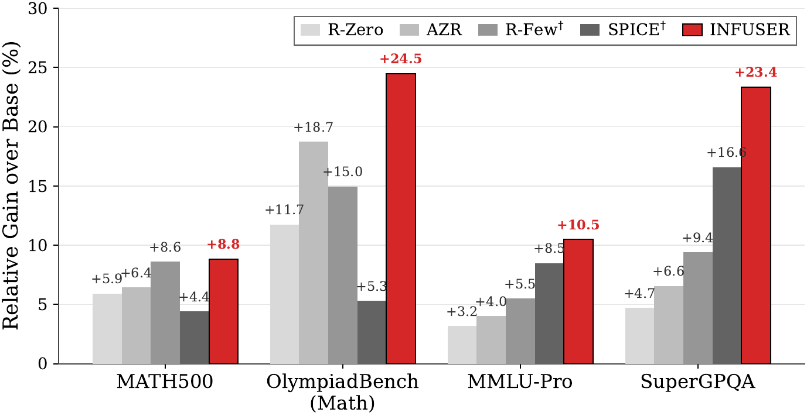
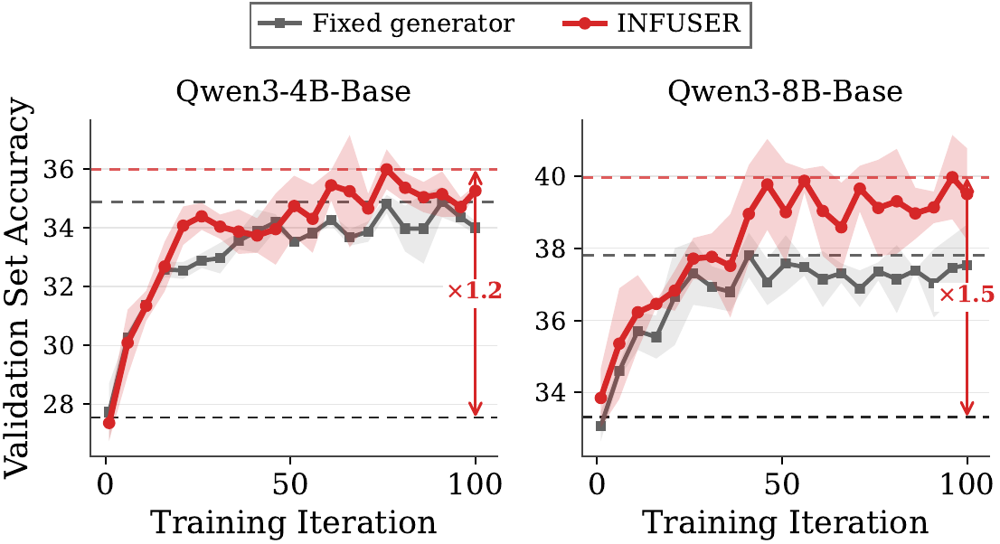
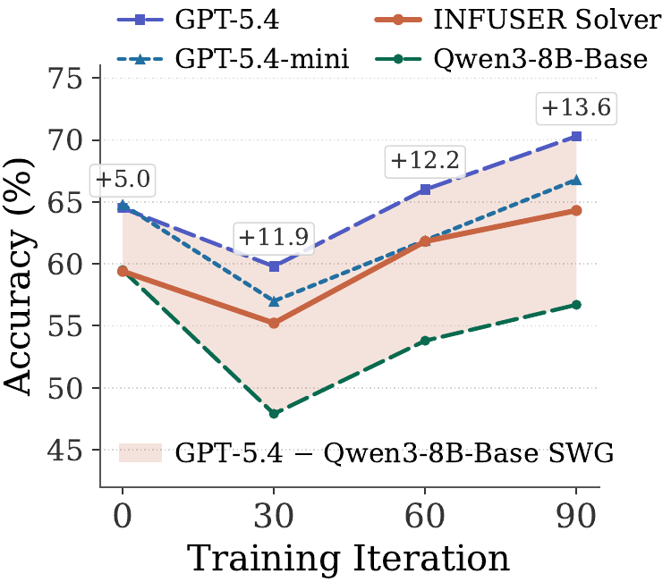

# INFUSER

> Influence-guided self-evolution for reasoning models: generate training
> questions from unlabeled documents, train a solver on them, and update the
> generator by whether its questions actually improve the solver.

[](https://arxiv.org/abs/2606.09052)
[](LICENSE)

INFUSER is the training and evaluation runtime for **Influence-Guided
Self-Evolution Improves Reasoning**. The framework co-trains two language-model
roles from a pretrained anchor:

- **Generator**: reads unstructured documents and writes multiple-choice
  reasoning questions with reference answers.
- **Solver**: answers generated questions and learns from verifier-based
  correctness rewards.

The key difference from difficulty-driven self-evolution is the generator
reward. INFUSER scores each generated question by an **optimizer-aware influence
signal**: would a solver update on this question align with the solver's
held-out target-gradient direction? This turns a document pool into an adaptive
curriculum that favors questions useful to the current solver.

<p align="center">
  
</p>

## Highlights

- **Document-grounded self-evolution**: starts from unlabeled source documents
  rather than a curated RLVR task pool or teacher-written training set.
- **Influence-guided generator training**: rewards questions according to their
  estimated utility for the solver's target distribution.
- **DuGRPO**: a dual-normalized GRPO variant for continuous, noisy influence
  rewards.
- **Unified training and evaluation stack**: INFUSER training, solver
  benchmark evaluation, document chunking, HF/R2/S3 artifact backends, local,
  SLURM, and K8s launchers.
- **Paper-scale recipes**: Qwen3-4B-Base and Qwen3-8B-Base configs used for the
  main experiments.

## Released Models and Artifacts

Released checkpoints, training data, and evaluation artifacts are hosted under
[Siyuc](https://huggingface.co/Siyuc) on Hugging Face:

| Link | Contents |
| --- | --- |
| [INFUSER-Qwen3-4B-base](https://huggingface.co/Siyuc/INFUSER-Qwen3-4B-base) | Trained Qwen3-4B-Base INFUSER solver checkpoint. |
| [INFUSER-Qwen3-8B-base](https://huggingface.co/Siyuc/INFUSER-Qwen3-8B-base) | Trained Qwen3-8B-Base INFUSER solver checkpoint. |
| [INFUSER-rlvr-Qwen3-8B-base](https://huggingface.co/Siyuc/INFUSER-rlvr-Qwen3-8B-base) | Trained Qwen3-8B-Base INFUSER+RLVR solver checkpoint. |
| [infuser_train](https://huggingface.co/datasets/Siyuc/infuser_train) | Preprocessed training documents, dev pools, and benchmark files. |
| [INFUSER-Qwen3-8B-base-artifacts](https://huggingface.co/datasets/Siyuc/INFUSER-Qwen3-8B-base-artifacts) | Qwen3-8B training artifacts for generator-quality evaluation. |

## Main Results

Scores below are solver accuracies (%) on the full benchmark suite trained by the code in this repository.

**Qwen3-8B-Base**

| Benchmark | Base | Fixed generator | INFUSER |
| --- | ---: | ---: | ---: |
| MMLU-Pro | 59.91 | 65.48 | **66.20** |
| GPQA-Diamond | 36.87 | **45.56** | 45.48 |
| SuperGPQA | 30.62 | **37.87** | 37.77 |
| BBEH | 10.30 | 12.79 | **13.04** |
| MATH500 | 76.05 | 78.70 | **82.77** |
| AIME2024 | 12.92 | 15.31 | **18.58** |
| AIME2025 | 11.87 | 14.06 | **15.87** |
| HMMT | 2.96 | 3.93 | **7.04** |
| OlympiadBench (Math) | 40.36 | 44.96 | **50.24** |
| OlympiadBench (Phys) | 12.29 | **14.83** | 14.41 |
| MedQA | 64.18 | 65.04 | **65.78** |
| MedXpertQA | 14.49 | 15.22 | **15.25** |
| HumanEval+ | 75.94 | 77.52 | **78.57** |
| LiveCodeBench v1-5 | 25.23 | 27.73 | **28.01** |

**Qwen3-4B-Base**

| Benchmark | Base | Fixed generator | INFUSER |
| --- | ---: | ---: | ---: |
| MMLU-Pro | 52.98 | 59.46 | **60.20** |
| GPQA-Diamond | 31.41 | **38.59** | 36.80 |
| SuperGPQA | 25.88 | 33.00 | **33.48** |
| BBEH | 7.57 | **11.33** | 11.22 |
| MATH500 | 61.20 | 76.25 | **76.65** |
| AIME2024 | 10.42 | 10.62 | **11.35** |
| AIME2025 | 8.44 | 8.85 | **10.73** |
| HMMT | 2.49 | 2.86 | **2.94** |
| OlympiadBench (Math) | 35.31 | **42.43** | 42.38 |
| OlympiadBench (Phys) | 10.17 | **12.71** | 10.31 |
| MedQA | 55.46 | 58.37 | **58.86** |
| MedXpertQA | 13.02 | **13.88** | 13.78 |
| HumanEval+ | 70.27 | 74.54 | **74.90** |
| LiveCodeBench v1-5 | 20.68 | 22.05 | **22.35** |

**OLMo-3-7B-Instruct-SFT**

| Benchmark | Base | Fixed generator | INFUSER |
| --- | ---: | ---: | ---: |
| MMLU-Pro | 49.0 | 51.5 | **54.1** |
| GPQA-Diamond | 31.6 | **36.2** | 35.6 |
| SuperGPQA | 22.8 | 26.7 | **28.4** |
| BBEH | 8.1 | **10.4** | 10.2 |
| MATH500 | 68.9 | 68.4 | **70.6** |
| AIME2024 | 5.8 | 6.3 | **6.8** |
| AIME2025 | 7.1 | 6.8 | **9.8** |
| HMMT | 3.2 | 4.5 | **4.8** |
| OlympiadBench (Math) | 32.20 | 34.27 | **34.57** |
| OlympiadBench (Phys) | 6.36 | 6.36 | 6.36 |
| MedQA | 45.1 | 43.1 | **45.3** |
| MedXpertQA | 12.7 | 13.4 | **14.2** |
| HumanEval+ | 67.2 | **68.0** | 66.6 |
| LiveCodeBench v1-5 | 12.8 | 10.6 | **13.3** |

<p align="center">
  
  
</p>

Additional findings from the paper:

- On Qwen3-8B-Base, INFUSER reaches the best category average across general
  reasoning, math and physics, medical, and coding benchmarks among the
  paper's compared methods.
- INFUSER improves aligned domains most strongly, with about 18-21% relative
  gains over the base model on general and math/physics category averages.
- The co-evolving generator is competitive with, and in several settings
  stronger than, using a frozen larger generator.
- Hybrid science-document plus RLVR training reduces cross-seed variance and improves math performance under the same total training budget.

<!-- <p align="center">
  
</p> -->

## Repository Layout

```text
verl_inf_evolve/              INFUSER training, influence scoring, and eval code
verl_inf_evolve/config/       Hydra configs and paper experiment overrides
verl_inf_evolve/sol_eval/     Solver benchmark evaluation harness
verl/                         Vendored verl runtime used by this project
launcher/                     Local, K8s, SLURM, and data-preparation launchers
launcher/opensource/          Docker image and open-source deployment notes
src/agent/scraper/            Document chunking and source preparation utilities
scripts/patches/opencompass/  OpenCompass patches for code benchmarks
tests/                        Unit tests for training, data, storage, and eval helpers
```

Run commands from the repository root so Python can resolve both `verl` and
`verl_inf_evolve`.

## Quickstart

The full pipeline is designed for a multi-GPU training environment with CUDA,
PyTorch, Ray, vLLM, Transformers, Hugging Face Hub, Hydra/OmegaConf, and the
standard `verl` dependencies already installed. Paper-scale runs use one node
with 8 H100 GPUs.

For a reproducible environment, use the pinned `verlai/verl` base image from
`launcher/opensource/Dockerfile.runtime`:

```text
verlai/verl@sha256:9576682f85ca36f4ef719efccc5a5deb4d0b6f66f06fc14f43fdfed0749fbf5d
```

That image supplies the CUDA/PyTorch/vLLM/Ray/verl stack. The root
`requirements.txt` installs only INFUSER's additional Python layer and does not
reinstall `torch`, `vllm`, `ray`, or `verl`.

### 1. Clone and install the INFUSER Python layer

```bash
git clone https://github.com/FFishy-git/INFUSER.git
cd INFUSER

export PYTHONPATH="$PWD:$PWD/verl:${PYTHONPATH:-}"
python -m pip install -r requirements.txt
```

Check that the base runtime and INFUSER dependency layer are visible:

```bash
python - <<'PY'
import datasets, ray, torch, vllm

print("datasets", datasets.__version__)
print("ray", ray.__version__)
print("torch", torch.__version__, "cuda", torch.cuda.is_available())
print("vllm", vllm.__version__)
PY
```

For optional code benchmarks (`humaneval`, `livecodebench`), install the
OpenCompass extras after the base requirements:

```bash
python -m pip install -r launcher/opensource/requirements-opencompass.txt
python -m pip install evalplus==0.3.1 --no-deps
python -m pip install tree-sitter==0.25.2 tree-sitter-python==0.25.0
```

### 2. Configure credentials

Public data/model access can run without tokens, but set `HF_TOKEN` for
gated/private Hugging Face access and `WANDB_API_KEY` for online logging.

```bash
cp .env.example .env
# Edit .env as needed.
```

The training and evaluation entrypoints automatically load `.env` from the
current working directory. To use another dotenv file, set
`VERL_INF_EVOLVE_DOTENV_PATH=/path/to/file.env`.

See [CREDENTIALS.md](CREDENTIALS.md) for the full variable matrix, including
Hugging Face, R2/S3-compatible storage, WandB, and API judge keys.

### 3. Download released data

The GitHub repository is code-only. Download the released preprocessed data and
benchmark files before training or solver evaluation:

```bash
python launcher/preparation/download_data.py \
  --use-preprocessed \
  --hf-repo Siyuc/infuser_train \
  --output-dir .cache/data
```

This creates the paths expected by the launchers:

```text
.cache/data/preprocessed/documents.json
.cache/data/preprocessed/curriculum_pool/supergpqa_science_800.json
.cache/data/preprocessed/benchmarks/
```

The release dataset also includes the Putnam/AIME/history variant used by the
hybrid science plus RLVR configs:

```text
.cache/data/preprocessed/documents_with_putnam_aime_history_math10000.json
.cache/data/preprocessed/curriculum_pool/supergpqa_science_pruned_400_aime_history_400.json
```

## Training

Before launching a paper-scale run, run the 8-GPU requirements smoke. It
exercises solver rollout, generated-question rollout, generated-answer rollout,
influence scoring, generator PPO, solver PPO, and checkpointing for two answer
loops while disabling benchmark eval, remote upload, and WandB.

```bash
python -m verl_inf_evolve.main \
  experiment_qwen3_4b_base=FW-Alr_2e-6-Glr_4e-6-DrGRPO-TIS_token-dev_800-precond_cos \
  training.max_ans_loop=2 \
  training.max_gen_loop=2 \
  benchmark_eval.enabled=false \
  training.remote_sync_path=null \
  training.resume_from_remote=false \
  wandb.enabled=false \
  trainer.logger='[console]'
```

Reproduce the main Qwen3-8B-Base recipe (e.g., for a different seed):

```bash
python -m verl_inf_evolve.main \
  experiment_qwen3_8b_base=FW-Alr_2e-6-Glr_4e-6-DrGRPO-TIS_token-dev_800-precond_cos-seed456 \
  training.remote_sync_path=null \
  training.resume_from_remote=false \
  wandb.enabled=false \
  trainer.logger='["console"]'
```

Run the Qwen3-8B-Base INFUSER+RLVR recipe:

```bash
python -m verl_inf_evolve.main \
  experiment_qwen3_8b_base=FW-Alr_2e-6-Glr_4e-6-DrGRPO-TIS_token-dev_400_aime400-precond_cos_putnam_aime_math10000-mideos_n0p5 \
  training.remote_sync_path=null \
  training.resume_from_remote=false \
  wandb.enabled=false \
  trainer.logger='["console"]'
```

This hybrid recipe uses the downloaded
`documents_with_putnam_aime_history_math10000.json` document pool and
`supergpqa_science_pruned_400_aime_history_400.json` dev set. It keeps the same
INFUSER influence objective, mixes science documents with Putnam/AIME-style
RLVR math data, and enables the mid-EOS penalty used by the paper run. For
multi-seed runs, use the `-seed123` and `-seed456` variants of the same
override.

Reproduce the main Qwen3-4B-Base recipe:

```bash
python -m verl_inf_evolve.main \
  experiment_qwen3_4b_base=FW-Alr_2e-6-Glr_6e-6-DrGRPO-TIS_token-dev_800-precond_cos \
  training.remote_sync_path=null \
  training.resume_from_remote=false \
  wandb.enabled=false \
  trainer.logger='["console"]'
```

Outputs are written under `training.default_local_dir`, which defaults to an
experiment-specific directory under `.output/`. To use remote checkpointing,
set `training.remote_sync_path` to an `hf://datasets/...`, `s3://...`, or
`r2://...` URI and provide credentials through environment variables.

## Paper Recipes

The main paper uses these Hydra experiment overrides:

| Model | Override |
| --- | --- |
| Qwen3-4B-Base | `experiment_qwen3_4b_base=FW-Alr_2e-6-Glr_6e-6-DrGRPO-TIS_token-dev_800-precond_cos` |
| Qwen3-8B-Base | `experiment_qwen3_8b_base=FW-Alr_2e-6-Glr_4e-6-DrGRPO-TIS_token-dev_800-precond_cos` |
| Qwen3-8B-Base INFUSER+RLVR | `experiment_qwen3_8b_base=FW-Alr_2e-6-Glr_4e-6-DrGRPO-TIS_token-dev_400_aime400-precond_cos_putnam_aime_math10000-mideos_n0p5` |

These overrides set the paper recipe: `training.max_ans_loop=100`,
`training.doc_batch_size=128`, `generator.rollout.n=8`, `solver.rollout.n=8`,
`influence.similarity_mode=preconditioned_cosine`, token-level truncated
importance sampling with threshold `2.0`, AdamW with weight decay `0.01`, solver
learning rate `2e-6`, and generator learning rates `6e-6` for Qwen3-4B-Base and
`4e-6` for Qwen3-8B-Base.

The INFUSER+RLVR override keeps the Qwen3-8B learning rates and influence
settings, swaps in the hybrid science plus Putnam/AIME-history data paths, and
uses a `-0.5` solver mid-EOS penalty.

## Solver Evaluation

Evaluate trained solver checkpoints with:

```bash
python -m verl_inf_evolve.sol_eval.sol_eval \
  eval.model_path=Qwen/Qwen3-8B-Base \
  eval.remote_sync_path=<TRAINING_OUTPUT_URI> \
  eval.run_name=<RUN_NAME> \
  eval.checkpoints='[95]' \
  eval.benchmarks='[math500,aime2024,aime2025,hmmt,olympiadbench,mmlu_pro,gpqa_diamond,supergpqa,bbeh,medqa,medxpertqa]' \
  eval.no_r2_upload=true \
  eval.no_wandb=true
```

For local HF-format checkpoints, set `eval.checkpoint_cache_dir` or
`eval.model_path` to the local checkpoint/model path and keep result upload
disabled.

The paper evaluation suite includes:

```text
math500, aime2024, aime2025, hmmt, olympiadbench, mmlu_pro,
gpqa_diamond, supergpqa, bbeh, medqa, medxpertqa
```

Coding benchmarks (`humaneval`, `livecodebench`) are evaluated through the
external OpenCompass/EvalPlus path and require the optional dependencies above.

## Configuration

Default Hydra configs live in `verl_inf_evolve/config/`:

- `self_evolution.yaml`: INFUSER training
- `sol_eval.yaml`: solver benchmark evaluation
- `gen_eval.yaml`: generator-quality evaluation

Experiment overrides are grouped under:

- `verl_inf_evolve/config/experiment_qwen3_4b_base/`
- `verl_inf_evolve/config/experiment_qwen3_8b_base/`
- `verl_inf_evolve/config/experiment_olmo_3_7b_instruct_sft/`
- `verl_inf_evolve/config/sol_eval_experiment/`

## Acknowledgements

INFUSER builds on the open-source `verl` training stack and evaluates against
several recent self-evolution and reasoning-training baselines, including
R-Zero, AZR, R-Few, SPICE, and General-Reasoner. We thank the maintainers of
these systems and benchmark suites for making reproducible comparison possible.

## Citation

If you use INFUSER, please cite:

```bibtex
@misc{chen2026infuser,
  title        = {INFUSER: Influence-Guided Self-Evolution Improves Reasoning},
  author       = {Siyu Chen and Miao Lu and Beining Wu and Heejune Sheen and Fengzhuo Zhang and Shuangning Li and Zhiyuan Li and Jose Blanchet and Tianhao Wang and Zhuoran Yang},
  year         = {2026},
  note         = {Preprint},
  url          = {https://arxiv.org/abs/2606.09052}
}
```

## License

This code is released under the [MIT License](LICENSE).
